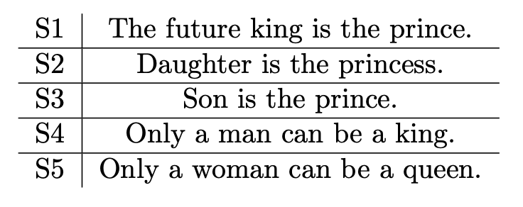
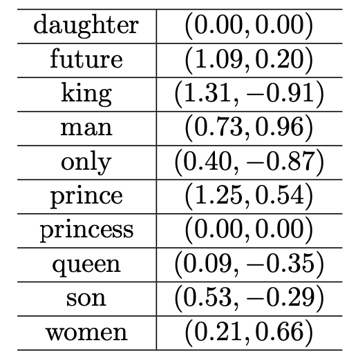

# Word Embedding, FeedForward Neural Network and RNNs

### Main Goal

* Compute word embeddings in a toy example.
* Play around with feedforward neural networks in PyTorch and use them to solve the sentiment classification problem
  from Project 1.
* Implement an RNN model for character-level classification.

## Word Embedding

The task is based on the Distributional Hypothesis, which states that words that occur in similar contexts tend to have
similar meanings.
By analyzing the co-occurrence of words in the corpus, numerical representations (word embeddings) of the words can be
derived.

* **Analyze Contexts:** Examine how words co-occur in the corpus to establish relationships between them.
* **Build Word Embeddings:** Use co-occurrence statistics to construct word vector representations step by step.
* **Understand Semantic Relationships:** Use the embeddings to uncover semantic similarities or differences, such as
  between "king" and "queen."

#### Example:

  

##### List all distinct words sorted by ascending alphabet order in this corpus, and compute the number of distinct words.

| words  | a | be | can | daughter | future | is | king | man | only | prince | princess | queen | son | the | woman |
|:------:|:-:|:--:|:---:|:--------:|:------:|:--:|:----:|:---:|:----:|:------:|:--------:|:-----:|:---:|:---:|:-----:|
| number | 4 | 2  |  2  |    1     |   1    | 3  |  2   |  1  |  2   |   2    |    1     |   1   |  1  |  3  |   1   |

##### Construct the word-word co-occurrence matrix M for window-size m = 4 (i.e., left 4 words and right 4 words).

|          | daughter | future | king | man | only | prince | princess | queen | son | woman |
|:--------:|:--------:|:------:|:----:|:---:|:----:|:------:|:--------:|:-----:|:---:|:-----:|
| daughter |    0     |   0    |  0   |  0  |  0   |   0    |    1     |   0   |  0  |   0   |
|  future  |    0     |   0    |  1   |  0  |  0   |   1    |    0     |   0   |  0  |   0   |
|   king   |    0     |   1    |  0   |  1  |  0   |   1    |    0     |   0   |  0  |   0   |
|   man    |    0     |   0    |  1   |  0  |  1   |   0    |    0     |   0   |  0  |   0   |
|   only   |    0     |   0    |  0   |  1  |  0   |   0    |    0     |   0   |  0  |   1   |
|  prince  |    0     |   1    |  1   |  0  |  0   |   0    |    0     |   0   |  1  |   0   |
| princess |    1     |   0    |  0   |  0  |  0   |   0    |    0     |   0   |  0  |   0   |
|  queen   |    0     |   0    |  0   |  0  |  0   |   0    |    0     |   0   |  0  |   1   |
|   son    |    0     |   0    |  0   |  0  |  0   |   1    |    0     |   0   |  0  |   0   |
|  woman   |    0     |   0    |  0   |  0  |  1   |   0    |    0     |   1   |  0  |   0   |

##### Use SVD to give the most possible semantic meanings of two new embedding words

  

**new word:**

- X = (0.20, -0.50),
- Y = (1.00, 0.00),

**calculate the cosine similarity:**

- inner product = w · x = w1 * x1 + w2 * x2
- normalization = sqrt(w1 * w1 + w2 * w2) * sqrt(x1 * x1 + x2 * x2)
- all of the calculation in y is the same as x

**consider X:**

|  words   |                 w · x                 |     normalization     |        cosine similarity         |
|:--------:|:-------------------------------------:|:---------------------:|:--------------------------------:|
| daughter |       0 * 0.2 + 0 * (-0.5) = 0        |     0 * 0.539 = 0     |                x                 |
|  future  |   1.09 * 0.2 + 0.2 * (-0.5) = 0.118   | 1.107 * 0.539 = 0.596 |      0.118 / 0.596 = 0.198       |
|   king   | 1.31 * 0.2 + (-0.91) * (-0.5) = 0.717 | 1.159 * 0.539 = 0.624 |      0.717 / 0.624 = 1.148       |
|   man    |  0.73 * 0.2 + 0.96 * (-0.5) = 0.334   | 1.206 * 0.539 = 0.650 |      0.334 / 0.650 = 0.514       |
|   only   | 0.4 * 0.2 + (-0.87) * (-0.5) = 0.515  | 0.957 * 0.539 = 0.515 |        0.515 / 0.515 = 1         |
|  prince  |  1.25 * 0.2 + 0.54 * (-0.5) = -0.02   | 1.361 * 0.539 = 0.734 |      -0.02 / 0.734 = -0.027      |
| princess |       0 * 0.2 + 0 * (-0.5) = 0        |     0 * 0.539 = 0     |                x                 |
|  queen   | 0.09 * 0.2 + (-0.35) * (-0.5) = 0.205 | 0.362 * 0.539 = 0.195 |      0.205 / 0.195 = 1.051       |
|   son    | 0.53 * 0.2 + (-0.29) * (-0.5) = 0.222 | 0.604 * 0.539 = 0.326 |      0.222 / 0.326 = 0.681       |
|  woman   |  0.21 * 0.2 + 0.66 * (-0.5) = 0.282   | 0.692 * 0.539 = 0.373 |      0.282 / 0.373 = 0.756       |
|          |                                       |                       | x has high probability in "only" |

**condiser Y:**

|  words   |             w · y             |   normalization   |         cosine similarity          |
|:--------:|:-----------------------------:|:-----------------:|:----------------------------------:|
| daughter |       0 * 1 + 0 * 0 = 0       |     0 * 1 = 0     |                 x                  |
|  future  |   1.09 * 1 + 0.2 * 0 = 1.09   | 1.107 * 1 = 1.107 |        1.09 / 1.107 = 0.984        |
|   king   | 1.31 * 1 + (-0.91) * 0 = 1.31 | 1.159 * 1 = 1.159 |        1.31 / 1.159 = 1.130        |
|   man    |  0.73 * 1 + 0.96 * 0 = 0.73   | 1.206 * 1 = 1.206 |        0.73 / 1.206 = 0.605        |
|   only   |  0.4 * 1 + (-0.87) * 0 = 0.4  | 0.957 * 1 = 0.957 |        0.4 / 0.957 = 0.418         |
|  prince  |  1.25 * 1 + 0.54 * 0 = 1.25   | 1.361 * 1 = 1.361 |        1.25 / 1.361 = 0.918        |
| princess |       0 * 1 + 0 * 0 = 0       |     0 * 1 = 0     |                 x                  |
|  queen   | 0.09 * 1 + (-0.35) * 0 = 0.09 | 0.362 * 1 = 0.362 |        0.09 / 0.362 = 0.249        |
|   son    | 0.53 * 1 + (-0.29) * 0 = 0.53 | 0.604 * 1 = 0.604 |        0.53 / 0.604 = 0.877        |
|  woman   |  0.21 * 1 + 0.66 * 0 = 0.21   | 0.692 * 1 = 0.692 |        0.21 / 0.692 = 0.304        |
|          |                               |                   | y has high probability in "future" |

## Deep Averaging Network

Deep Average Network (DAN) is a typical deep unordered model obtaining nearly state-of-the-art accuracy on sen- tence or
document-level tasks with very little training time.

**Use basic method to train a DAN**

* record different hyperparameter in following [README](Deep_Averaging_Network/README.md)

## Character Language Modeling with RNNs

Binary classification of fixed-length (20 characters) sequences to predict whether the given sequence is followed by a
consonant or a vowel (0 for consonant, 1 for vowel)

**Result:**

| Valid Accuracy | Total training time |
|:--------------:|:-------------------:|
|     0.8100     |      30.1909s       |